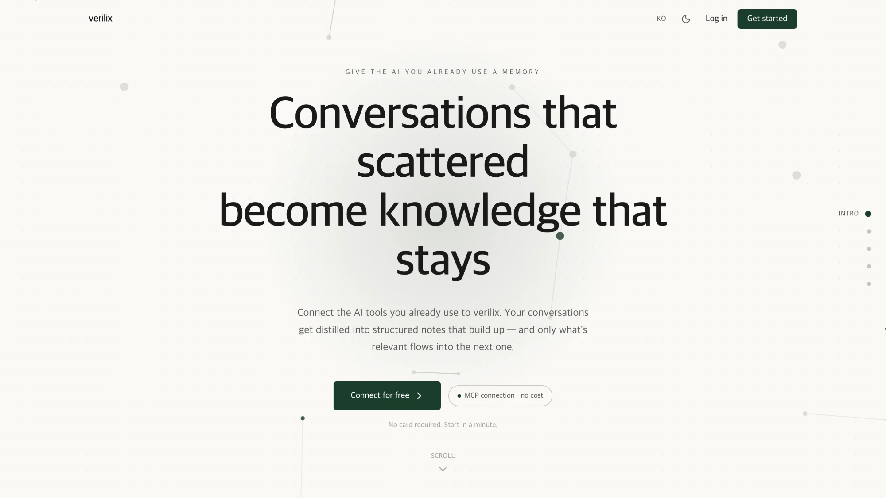
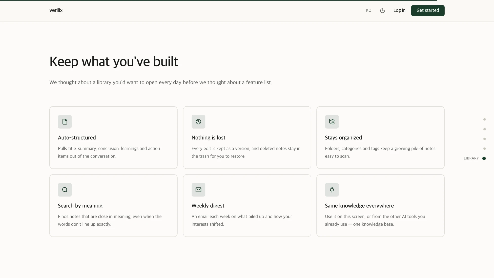
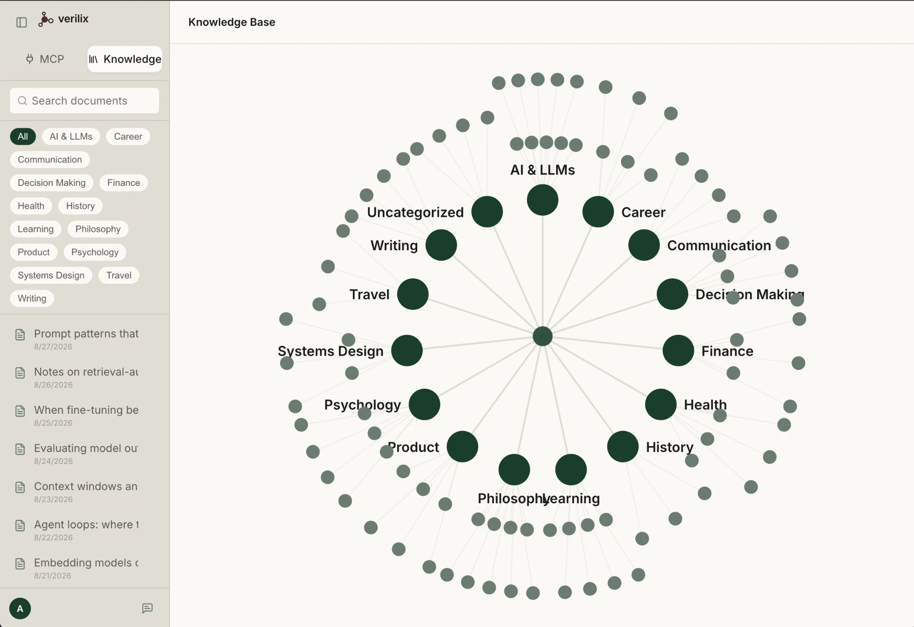

# verilix

[English](README.md) · **한국어**

**MCP로 연결된 AI(ChatGPT · Claude · Gemini)와의 대화를 구조화된 문서로 쌓아, 다음 대화를 더 깊게 만드는 개인 지식 베이스.**

> 이미 쓰고 있는 AI 도구에 그대로 연결됩니다. 대화의 결론이 문서로 남고, 그 문서들이 쌓여 다음 대화의 컨텍스트가 됩니다.

## 스크린샷


| 랜딩 — 라이브러리 소개 | 지식 지도 |
|---|---|
|  |  |

**라이브**: https://verilix.vercel.app · **데모(가상 데이터)**: https://verilix.vercel.app/ko/demo/notes

## 주요 기능
- **MCP 서버** — 12개 툴(검색·저장·편집·삭제/복구·버전 이력·링크·카테고리·폴더). OAuth(PKCE + 동의 화면) 또는 API 키로 연결
- **git 방식 문서 버전 관리** — 수정/삭제 전 상태를 커밋 메시지와 함께 스냅샷, 소프트 삭제 + 롤백
- **하이브리드 검색** — 의미 검색(pgvector) + 단어 검색(tsvector/부분 문자열)
- **지식 지도** — 카테고리 · 문서 · 관련 문서 링크를 방사형으로 시각화
- **주간 다이제스트** — 관심사 변화(서버가 계산)와 기존 문서들과의 모순을 요약해 매주 메일 발송
- 다크모드, 한/영 다국어, 모바일 반응형

## 기술 스택
Next.js (App Router) · TypeScript · Tailwind CSS v4 · Supabase (Postgres, pgvector, RLS, Auth) · Anthropic API · Gemini Embeddings · Vercel

## 설계 포인트
- **RLS 중심 보안**: 모든 테이블 RLS, 서비스 롤은 서버 전용 + 소유자 검증 후에만 사용. 권한 컬럼은 트리거로 보호, `security definer` 함수는 명시적 권한 회수. 자세한 원칙은 [CLAUDE.md](CLAUDE.md)의 "보안 모델" 참고
- **OAuth 자체 구현**: RFC 7591(DCR) / 8414 / 9728 / PKCE, 동의 화면 + CSRF·clickjacking·XSS 방어, 코드·리프레시 토큰 단일 사용 보장
- **서버 결정론 + LLM 서술 분리**: 다이제스트의 트렌드는 스냅샷 diff로 서버가 계산하고, LLM은 설명만 작성

## 실행
```bash
cp .env.example .env.local   # 값 채우기
npm install
npm run dev
```
Supabase 프로젝트에 `supabase/migrations/`를 순서대로 적용해야 합니다.

## 라이선스
라이선스를 지정하지 않았습니다. 포트폴리오 열람 목적으로 공개한 저장소이며, 별도 허락 없이 복제·재배포·상업적 이용을 할 수 없습니다(All rights reserved).
